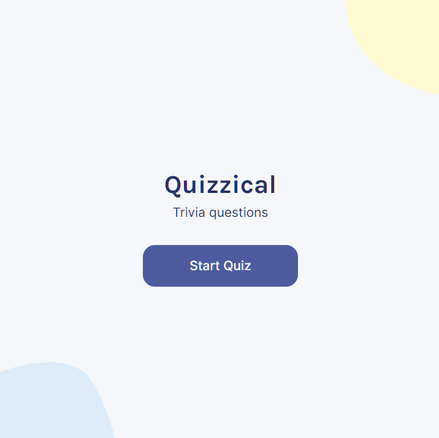
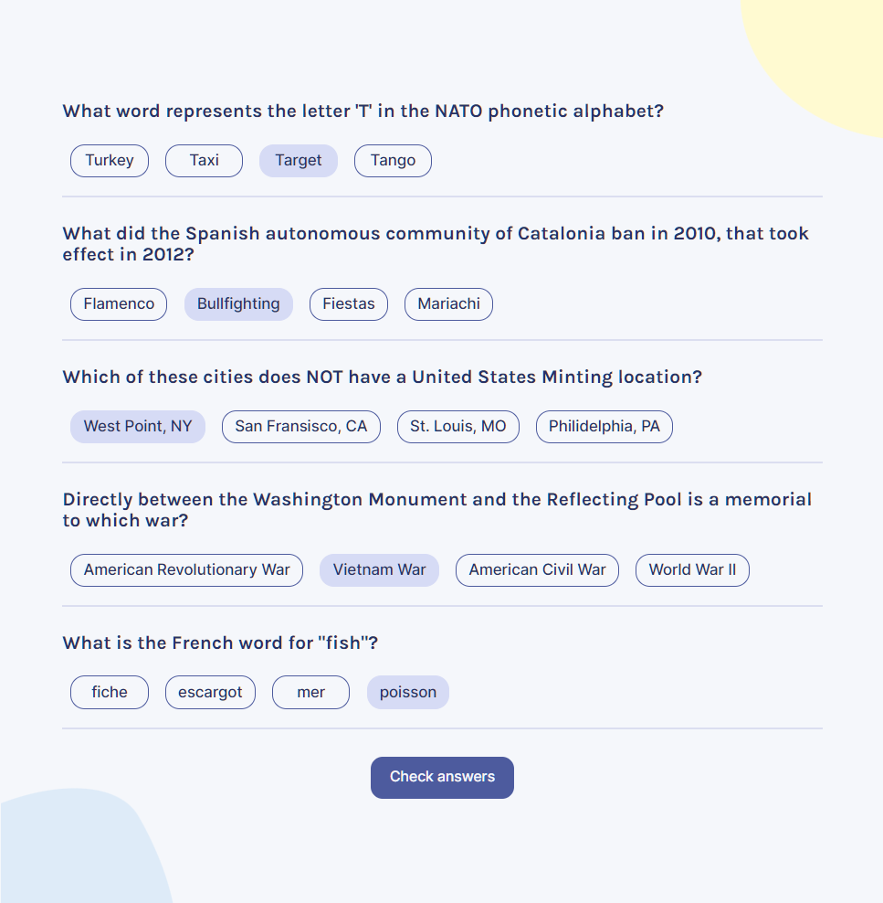
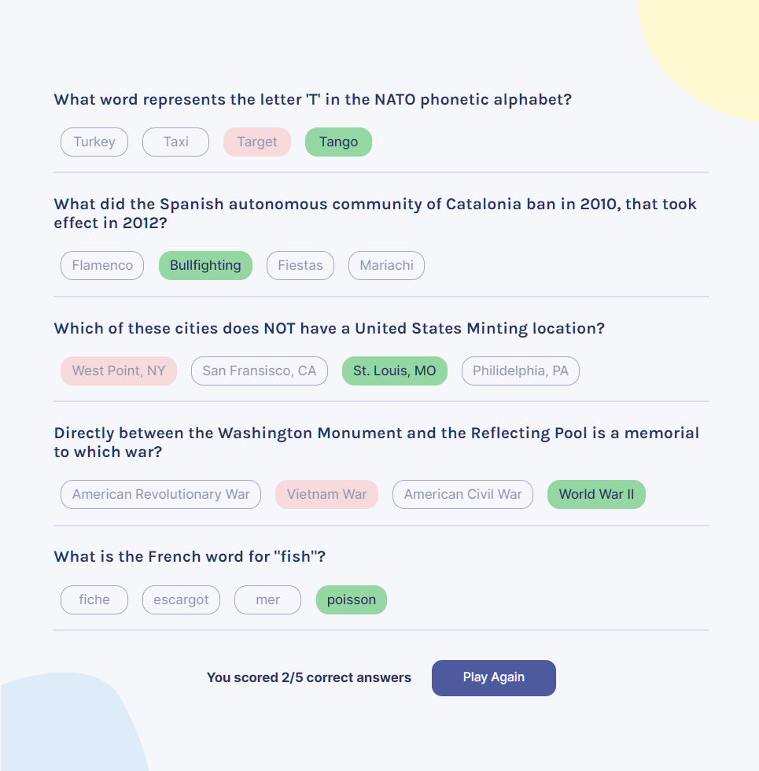

# Quizzical

Quizzical is a short trivia questionnaire whose questions are pulled from the Open Trivia Database API. After clicking the start quiz button, you select answers for each multiple choice question. You can get your quiz score by hitting the Check Answers button. If you didn't answer all the quesitons, an alert will tell you to answer all of them before getting your score. Correct answers will be highlighted in green, and if you chose the wrong answer, it will be highlighted in red. The score is at the bottom of the app and you can play again if you wish.
## Gameplay

### Start Quiz (Home screen)

### Answer Questions

### Check Answers

